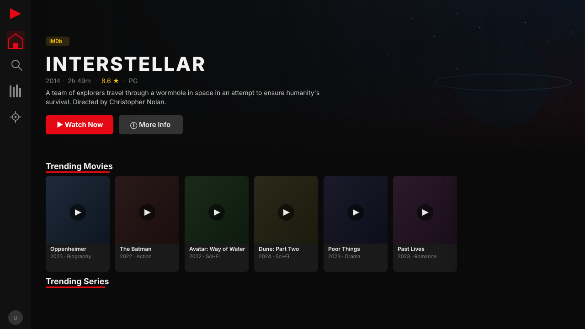
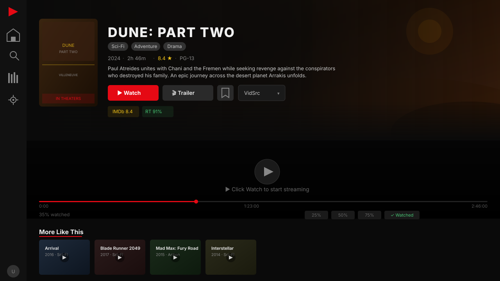
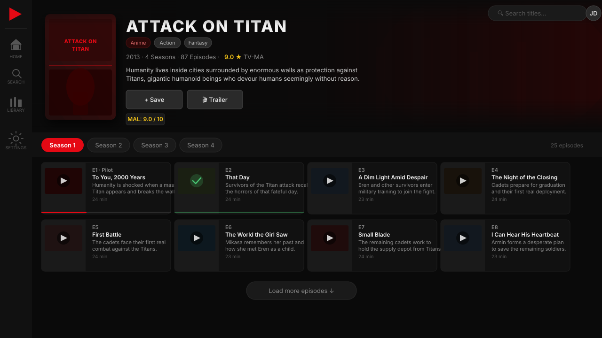
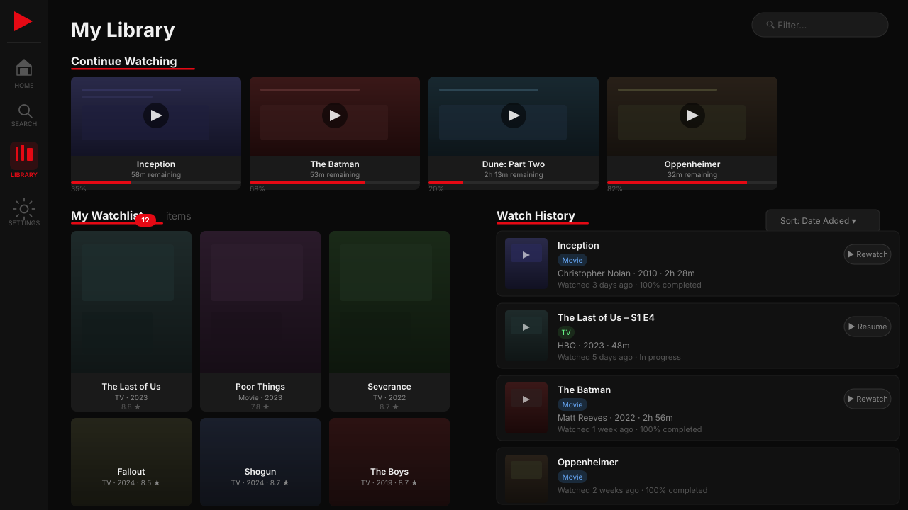
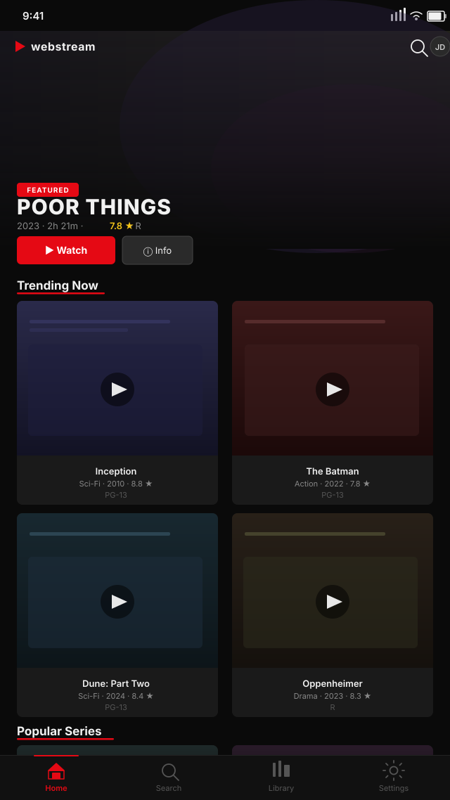

# Streambert Web

A browser-based, mobile-friendly streaming frontend for movies, TV shows, and anime — ad-free and tracker-free. Runs entirely client-side and can be hosted on GitHub Pages.



---

## Features

- **Browse & stream** movies, TV series, and anime worldwide
- **Multiple player sources** — switch between VidSrc, Videasy, 2Embed, and AllManga
- **Anime support** — AniList metadata, season mapping, and dedicated anime sources
- **Watch progress** — per-episode tracking with continue-watching row
- **Library** — watchlist, history, in-progress items with four sort modes
- **Search** — debounced TMDB multi-search with recent history
- **Customisable** — 6 accent colours, font sizes, compact mode, home row ordering
- **Backup & restore** — export/import your full library as JSON
- **Mobile-first** — bottom tab nav on phones, full responsive layout
- **No account required** — all data stored locally in your browser

---

## Screenshots

| Home | Movie |
|---|---|
|  |  |

| TV & Episodes | Library |
|---|---|
|  |  |

| Mobile |
|---|
|  |

---

## Getting Started

### 1. Get a TMDB API key (free)

The app uses [The Movie Database](https://www.themoviedb.org/) for all movie and TV metadata.

1. Create a free account at themoviedb.org
2. Go to **Settings → API** and request an API key
3. Copy your **Read Access Token** (the long JWT, not the short API key)

### 2. Run locally

```bash
git clone https://github.com/itaishopen/web-streaming
cd web-streaming
npm install
npm run dev
```

Open `http://localhost:5173/web-streaming/` and paste your TMDB Read Access Token when prompted.

### 3. Deploy to GitHub Pages

Push to `main` — the included GitHub Actions workflow builds and deploys automatically.

Enable Pages in your repo: **Settings → Pages → Source: GitHub Actions**.

---

## Tech Stack

| Layer | Technology |
|---|---|
| App framework | Vue 3 (Composition API + TypeScript) |
| UI components | Lit web components (TypeScript) |
| Routing | Vue Router (hash mode) |
| Build tool | Vite |
| Unit tests | Jest + ts-jest |
| E2E tests | Playwright (Chromium, Firefox, Mobile) |
| Deployment | GitHub Actions → GitHub Pages |

---

## Running Tests

```bash
# Unit tests (Jest) — 147 tests
npm run test:unit

# E2E tests (Playwright) — requires dev server
npm run test:e2e

# Both
npm test
```

---

## ⚖️ Legal & Disclaimer

### What this application is

Streambert Web is an **open-source media browser and frontend interface**. It is a client-side web application that:

- Fetches **metadata only** (titles, posters, descriptions, ratings) from [The Movie Database (TMDB) API](https://www.themoviedb.org/documentation/api), under TMDB's free API terms
- **Embeds third-party video players** via `<iframe>` — it does not host, store, proxy, upload, or distribute any video content itself
- Stores all user data (watchlist, history, settings) **locally in your own browser** — no data is sent to any server operated by this project
- Has **no backend, no database, no accounts, and no servers**

### Third-party embedded players

When you click "Watch", the app loads a video player from an independent third-party service (VidSrc, Videasy, 2Embed, or AllManga) inside an iframe — the same way any website embeds a YouTube video. **This project has no control over, affiliation with, or responsibility for those third-party services**, their content libraries, or their compliance with copyright law.

The availability, legality, and licensing status of content on those platforms varies by country and title. **You are solely responsible for ensuring that your use of those platforms complies with the laws of your jurisdiction.**

### User responsibility

By using this application you acknowledge:

1. **This app does not provide or guarantee access to any copyrighted content.** It is a UI layer that points to external embeds.
2. Streaming unlicensed content may be illegal in your country. Check your local laws before using third-party streaming embeds.
3. The developers of this project are not liable for any legal consequences arising from your use of embedded third-party services.
4. If you are a rights holder and believe a linked third-party platform is infringing your content, contact that platform directly — this project has no ability to remove content from external services.

### TMDB

This product uses the TMDB API but is not endorsed or certified by TMDB.

### Open source

This project is released under the **GPL-3.0 License**. The source code itself — the Vue components, Lit web components, TypeScript utilities, and build configuration — contains no copyrighted media and is freely available for personal, educational, and non-commercial use.

---

## Project Structure

```
src/
├── components/          # Lit web components
│   ├── app-sidebar.ts   # Navigation sidebar + mobile bottom bar
│   ├── media-card.ts    # Poster card with progress & context menu
│   ├── trending-carousel.ts
│   ├── search-modal.ts
│   ├── setup-screen.ts  # First-run API key setup
│   └── trailer-modal.ts
├── pages/               # Vue 3 pages
│   ├── HomePage.vue
│   ├── MoviePage.vue
│   ├── TVPage.vue
│   ├── LibraryPage.vue
│   └── SettingsPage.vue
├── composables/         # Vue composables
│   ├── useLibrary.ts
│   ├── useSettings.ts
│   └── useSearch.ts
├── utils/               # Framework-agnostic TypeScript
│   ├── api.ts           # TMDB + AniList + player sources
│   ├── storage.ts
│   ├── ageRating.ts
│   ├── appearance.ts
│   ├── homeLayout.ts
│   └── backup.ts
└── types/index.ts

e2e/                     # Playwright E2E tests
src/__tests__/           # Jest unit tests
.github/workflows/       # GitHub Actions deploy
```

---

## Contributing

Pull requests are welcome. For major changes, open an issue first.

Please run `npm run test:unit` before submitting — all 147 unit tests must pass.
